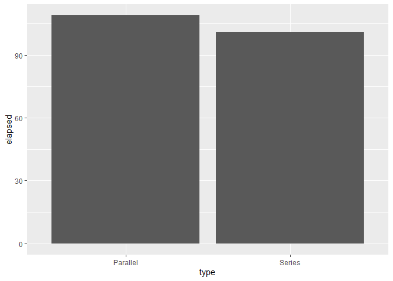

``` r
rm(list=ls())

#Script modified from
#http://r-statistics.co/Parallel-Computing-With-R.html
```

# Register a SOCK and number of cores

``` r
# Registering cores for parallel process
library(doSNOW)
```

    ## Warning: package 'doSNOW' was built under R version 4.1.1

    ## Loading required package: foreach

    ## Warning: package 'foreach' was built under R version 4.1.1

    ## Loading required package: iterators

    ## Loading required package: snow

``` r
cl <- makeCluster(2, type="SOCK") # 4 – number of cores
registerDoSNOW(cl) # Register back end Cores for Parallel Computing
```

# Some simple parallel code

``` r
library(foreach)
foreach(i = 1:28) %dopar% {sqrt(i)} # example 1
```

    ## [[1]]
    ## [1] 1
    ## 
    ## [[2]]
    ## [1] 1.414214
    ## 
    ## [[3]]
    ## [1] 1.732051
    ## 
    ## [[4]]
    ## [1] 2
    ## 
    ## [[5]]
    ## [1] 2.236068
    ## 
    ## [[6]]
    ## [1] 2.44949
    ## 
    ## [[7]]
    ## [1] 2.645751
    ## 
    ## [[8]]
    ## [1] 2.828427
    ## 
    ## [[9]]
    ## [1] 3
    ## 
    ## [[10]]
    ## [1] 3.162278
    ## 
    ## [[11]]
    ## [1] 3.316625
    ## 
    ## [[12]]
    ## [1] 3.464102
    ## 
    ## [[13]]
    ## [1] 3.605551
    ## 
    ## [[14]]
    ## [1] 3.741657
    ## 
    ## [[15]]
    ## [1] 3.872983
    ## 
    ## [[16]]
    ## [1] 4
    ## 
    ## [[17]]
    ## [1] 4.123106
    ## 
    ## [[18]]
    ## [1] 4.242641
    ## 
    ## [[19]]
    ## [1] 4.358899
    ## 
    ## [[20]]
    ## [1] 4.472136
    ## 
    ## [[21]]
    ## [1] 4.582576
    ## 
    ## [[22]]
    ## [1] 4.690416
    ## 
    ## [[23]]
    ## [1] 4.795832
    ## 
    ## [[24]]
    ## [1] 4.898979
    ## 
    ## [[25]]
    ## [1] 5
    ## 
    ## [[26]]
    ## [1] 5.09902
    ## 
    ## [[27]]
    ## [1] 5.196152
    ## 
    ## [[28]]
    ## [1] 5.291503

``` r
# returned output values of the parallel process are combined using 'c()' function
foreach(i = 1:28,.combine = "c") %dopar% {sqrt(i)} # example 2
```

    ##  [1] 1.000000 1.414214 1.732051 2.000000 2.236068 2.449490 2.645751 2.828427
    ##  [9] 3.000000 3.162278 3.316625 3.464102 3.605551 3.741657 3.872983 4.000000
    ## [17] 4.123106 4.242641 4.358899 4.472136 4.582576 4.690416 4.795832 4.898979
    ## [25] 5.000000 5.099020 5.196152 5.291503

``` r
# returned output values of the parallel process are combined using 'cbind()' function
foreach(i = 1:28,.combine = "cbind") %dopar% {letters[1:4]} # example 3
```

    ##      result.1 result.2 result.3 result.4 result.5 result.6 result.7 result.8
    ## [1,] "a"      "a"      "a"      "a"      "a"      "a"      "a"      "a"     
    ## [2,] "b"      "b"      "b"      "b"      "b"      "b"      "b"      "b"     
    ## [3,] "c"      "c"      "c"      "c"      "c"      "c"      "c"      "c"     
    ## [4,] "d"      "d"      "d"      "d"      "d"      "d"      "d"      "d"     
    ##      result.9 result.10 result.11 result.12 result.13 result.14 result.15
    ## [1,] "a"      "a"       "a"       "a"       "a"       "a"       "a"      
    ## [2,] "b"      "b"       "b"       "b"       "b"       "b"       "b"      
    ## [3,] "c"      "c"       "c"       "c"       "c"       "c"       "c"      
    ## [4,] "d"      "d"       "d"       "d"       "d"       "d"       "d"      
    ##      result.16 result.17 result.18 result.19 result.20 result.21 result.22
    ## [1,] "a"       "a"       "a"       "a"       "a"       "a"       "a"      
    ## [2,] "b"       "b"       "b"       "b"       "b"       "b"       "b"      
    ## [3,] "c"       "c"       "c"       "c"       "c"       "c"       "c"      
    ## [4,] "d"       "d"       "d"       "d"       "d"       "d"       "d"      
    ##      result.23 result.24 result.25 result.26 result.27 result.28
    ## [1,] "a"       "a"       "a"       "a"       "a"       "a"      
    ## [2,] "b"       "b"       "b"       "b"       "b"       "b"      
    ## [3,] "c"       "c"       "c"       "c"       "c"       "c"      
    ## [4,] "d"       "d"       "d"       "d"       "d"       "d"

``` r
# Using your custom defined function: "myCustomFunc()" and store in 'output' variable # Example 4
myCustomFunc <- function(i){sqrt(i)+25}

output <- foreach(i = 1:28, .combine = "cbind") %dopar% {
  myCustomFunc(i)
}
```

``` r
stopCluster(cl)
```

# Examples

inputData &lt;- matrix(1:800000, ncol=4) \# prepare input data

output = col1 - col2 + col3 / col4

``` r
inputData <- matrix(1:80000, ncol=4)

output_serial <- numeric() # initialize output

for (rowNum in c(1:nrow(inputData))) {
  calculatedOutput <- inputData[rowNum, 1] - inputData[rowNum, 2] + inputData[rowNum, 3] / inputData[rowNum, 4] # compute output
  output_serial <- c(output_serial, calculatedOutput) # append to output variable
}

head(output_serial)
```

    ## [1] -19999.33 -19999.33 -19999.33 -19999.33 -19999.33 -19999.33

# Running in Parallel

``` r
library(doSNOW)

cl <- makeCluster(2, type = "SOCK") # 4 – number of cores
registerDoSNOW(cl) # Register Backend Cores for Parallel Computing
allRowIndices <-
  c(1:nrow(inputData)) # row numbers of inputData, that will be processed in parallel

output_parallel <-
  foreach (rowNum = allRowIndices, .combine = c) %dopar% {
    
    # compute output
    
    calculatedOutput <-
      inputData[rowNum, 1] - inputData[rowNum, 2] + inputData[rowNum, 3] / inputData[rowNum, 4] 
    
    return (calculatedOutput)
  }

head(output_parallel)
```

    ## [1] -19999.33 -19999.33 -19999.33 -19999.33 -19999.33 -19999.33

# Calculate the time needed to run the two functions

``` r
system.time(
  for (rowNum in c(1:nrow(inputData))) {
    calculatedOutput <- inputData[rowNum, 1] - inputData[rowNum, 2] + inputData[rowNum, 3] / inputData[rowNum, 4] 
    
    # compute output
    output_serial <- c(output_serial, calculatedOutput) # append to output variable
  }
)
```

    ##    user  system elapsed 
    ##    1.98    0.02    2.02

``` r
system.time(
  output_parallel <- foreach (rowNum = allRowIndices, .combine = c) %dopar% {
    calculatedOutput <- inputData[rowNum, 1] - inputData[rowNum, 2] + inputData[rowNum, 3] / inputData[rowNum, 4] # compute output
    return (calculatedOutput)
  }
)
```

    ##    user  system elapsed 
    ##    8.59    0.89    9.70

# Unregistering Cluster

``` r
stopCluster(cl)
```

# When parallelism actually matters

``` r
inputData <- matrix(1:800000, ncol=4)

series_time <- system.time(
  for (rowNum in c(1:nrow(inputData))) {
    calculatedOutput <- inputData[rowNum, 1] - inputData[rowNum, 2] + inputData[rowNum, 3] / inputData[rowNum, 4] 
    
    # compute output
    output_serial <- c(output_serial, calculatedOutput) # append to output variable
  }
)

series_time
```

    ##    user  system elapsed 
    ##   99.14    0.82  100.78

``` r
cl <- makeCluster(2, type = "SOCK") # 4 – number of cores
registerDoSNOW(cl) # Register Backend Cores for Parallel Computing
allRowIndices <-
  c(1:nrow(inputData)) # row numbers of inputData, that will be processed in parallel

parallel_time <- system.time(
  output_parallel <- foreach (rowNum = allRowIndices, .combine = c) %dopar% {
    calculatedOutput <- inputData[rowNum, 1] - inputData[rowNum, 2] + inputData[rowNum, 3] / inputData[rowNum, 4] # compute output
    return (calculatedOutput)
  }
)

parallel_time
```

    ##    user  system elapsed 
    ##   97.57    8.78  108.88

# Something People want to see

``` r
time <- system.time(plot(iris))

plotdata <- as.data.frame(matrix(rep(1:4),ncol=2))
plotdata$type <-  c("Series","Parallel")
plotdata$elapsed <- c(series_time[3],parallel_time[3])

library(ggplot2)
```

<!-- -->

``` r
ggplot(data=plotdata,aes(x=type,y=elapsed)) + geom_col()
```

<!-- -->
